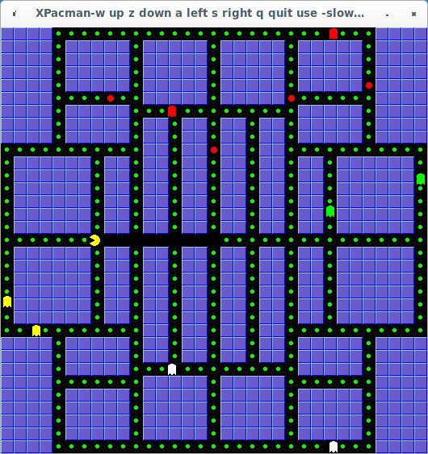

# XPacman

(c) Peter Warden 14th August 1996

This is a basic version of pacman. I've tried to concentrate on the essentials
of the game for now, which means a lot of the original features are absent (ie
no scores, no fruit, no special items, no lives). When all the pills have been 
cleared from a level, the difficulty level is notched up, and a new level is
generated. If you collide with a ghost, all the pills are replaced, and you
restart the current level from scratch. A new feature just added is the
presence of large red pills that for a short time turn the ghosts grey and let
you eat them.



## Keys:

The default keys are:
```
 - a  :move left
 - s  :move right
 - z  :move down
 - w  :move up
 - q  :quit the game
 ```
The game is paused when it loses the keyboard input focus and unpauses when it
regains it.

## Command line options:

  -upkey -downkey -leftkey & -rightkey followed by a character allow you to set
   which keys make you move in which directions.

  -quitkey followed by a character sets the quit key.

  -framerate followed by a number sets the maximum number of frames that will
   be displayed per second, so altering the games speed (default is 15).

  -level followed by a number sets the difficulty level (default is 0).

  -width & -height followed by a number specify the width and height of the 
   playing area, in 16 pixel units (default is 33x33 squares).


## Installation:

Installing xpacman:
```sh
autoreconf -i
automake
./configure
make
sudo make install
```

### Original Greetings (from Peter Warden, year1996):

My thanks go to Danny Backx, Garland Stern, Larry Schwimmer, Oeyvind Roetvold
and everybody else who's given their time and expertise to help me improve this
project.

Absolutely no warranty is given for this program.

If you have any problems with xpacman, find any bugs, have a suggestion, or just
enjoyed the game, email me and let me know.

Peter Warden (wardenp@cs.man.ac.uk)

### Additional Greetings (from Joe Da Silva, year2024):

Thanks to Steve McIntyre <stevem@chiark.greenend.org.uk>, 1997, for creating
xpacman.6 man  page.

Fixed a few bugs, and added autoconf/automake to help build and install xpacman, and desktop GUI files for click-n-run expected in today's modern PCs. [Go here if you need to report an issue, or better yet, please create a PR for a bug fix](https://github.com/JoesCat/xpacman/issues)
